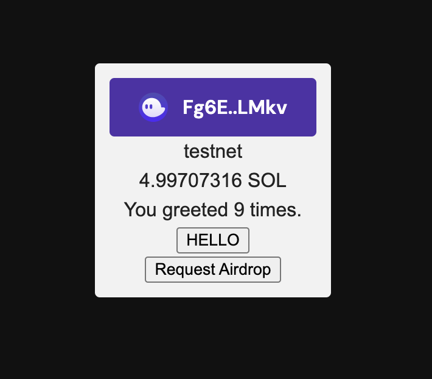

This is an example of E2E Solana app based on [Solana's hello world](https://github.com/solana-labs/example-helloworld). This project provides example web app integrated with browser extension wallets. 

The app shows the balance of a connected wallet and how many times the wallet account greeted.


This app is let to work on testnetwork only!!

Integrated components / libraries
- React to render UI
- [Solana wallet adoptor](https://github.com/solana-labs/wallet-adapter/) to connect app to browser wallets.

# Commands

## Create a Solana wallet
```
solana-keygen new 
```

## Change network
```
solana config set --url https://api.devnet.solana.com
```

## Airdrop
```
solana airdrop 1
```

## Check balance
```
solana balance
```

## Deploy program
```
solana program deploy path/to/file.so
```

## How to check the public key of the program stored as a JSON.
```
solana address -k path/to/keypair.json
```